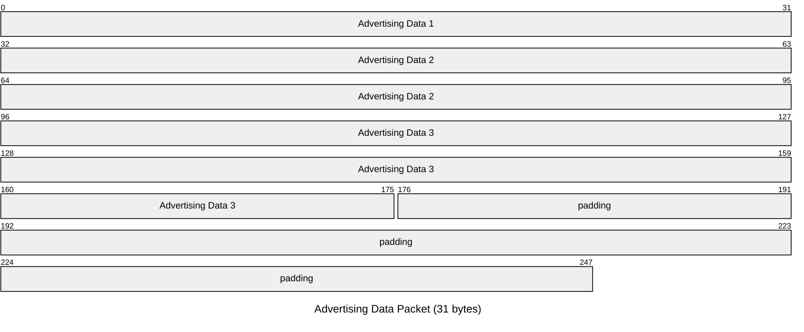
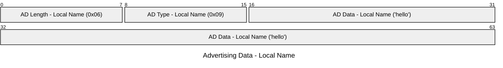
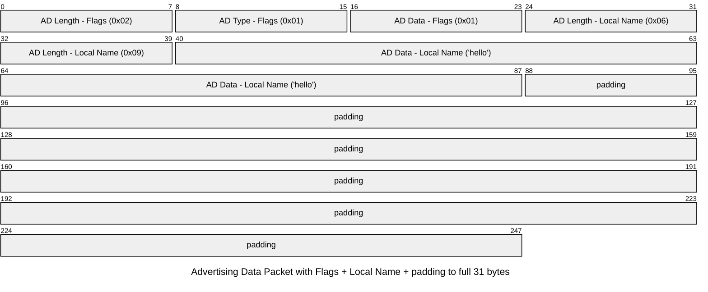
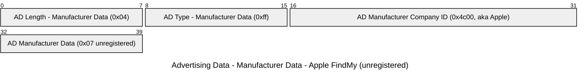
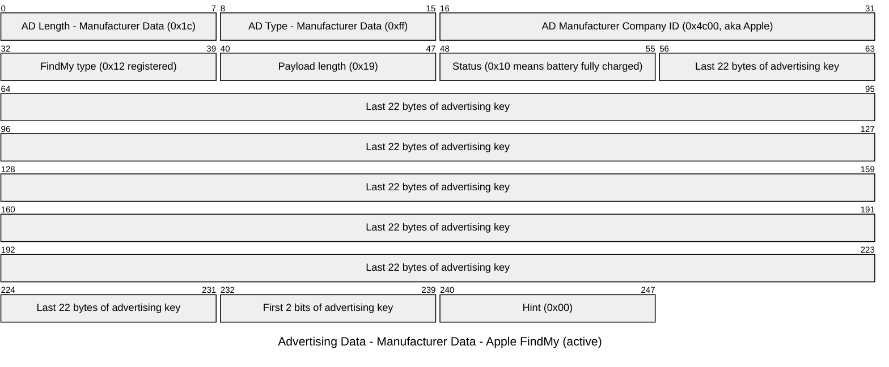

```mermaid
---
title: "Advertising Data Packet (31 bytes)"
---
packet-beta
  0-31: "Advertising Data 1"
  32-95: "Advertising Data 2"
  96-175: "Advertising Data 3"
  176-247: "padding"
```

```mermaid
---
title: "Advertising Data - Flags"
---
packet-beta
  0-7: "AD Length - Flags (0x02)"
  8-15: "AD Type - Flags (0x01)"
  16-23: "AD Data - Flags (0x01)"
```

```mermaid
---
title: "Advertising Data - Local Name"
---
packet-beta
  0-7: "AD Length - Local Name (0x06)"
  8-15: "AD Type - Local Name (0x09)"
  16-63: "AD Data - Local Name ('hello')"
```

```mermaid
---
title: "Advertising Data Packet with Flags + Local Name + padding to full 31 bytes"
---
packet-beta
  0-7: "AD Length - Flags (0x02)"
  8-15: "AD Type - Flags (0x01)"
  16-23: "AD Data - Flags (0x01)"
  24-31: "AD Length - Local Name (0x06)"
  32-39: "AD Length - Local Name (0x09)"
  40-87: "AD Data - Local Name ('hello')"
  88-247: "padding"
```

```mermaid
---
title: "Advertising Data - Manufacturer Data - Apple FindMy (unregistered)"
---
packet-beta
  0-7: "AD Length - Manufacturer Data (0x04)"
  8-15: "AD Type - Manufacturer Data (0xff)"
  16-31: "AD Manufacturer Company ID (0x4c00, aka Apple)"
  32-39: "AD Manufacturer Data (0x07 unregistered)"
```

```mermaid
---
title: "Advertising Data - Manufacturer Data - Apple FindMy (active)"
---
packet-beta
  0-7: "AD Length - Manufacturer Data (0x1c)"
  8-15: "AD Type - Manufacturer Data (0xff)"
  16-31: "AD Manufacturer Company ID (0x4c00, aka Apple)"
  32-39: "FindMy type (0x12 registered)"
  40-47: "Payload length (0x19)"
  48-55: "Status (0x10 means battery fully charged)"
  56-231: "Last 22 bytes of advertising key"
  232-239: "First 2 bits of advertising key"
  240-247: "Hint (0x00)"
```
