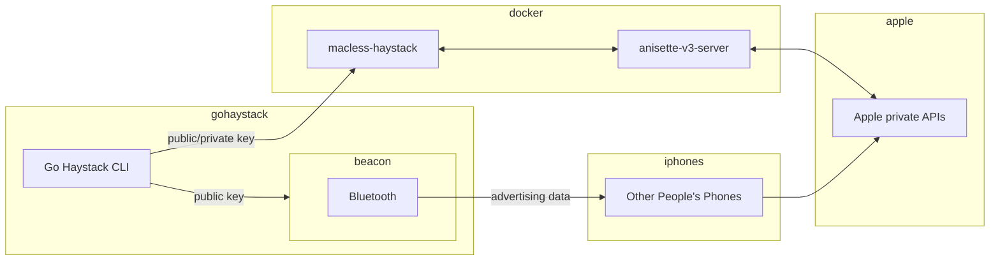

```mermaid
flowchart LR
    subgraph gohaystack
        haystack[Go Haystack CLI]--public key-->beacon
    end
    subgraph beacon
        Bluetooth
    end
    subgraph docker
        macless[macless-haystack]<-->anisette-v3-server
        anisette-v3-server
    end
    haystack--public/private key-->macless
    subgraph apple
        anisette-v3-server<-->Apple
        Apple[Apple private APIs]
    end
    subgraph iphones
        Bluetooth--advertising data-->opp[Other People's Phones]
        opp-->Apple
    end
```
